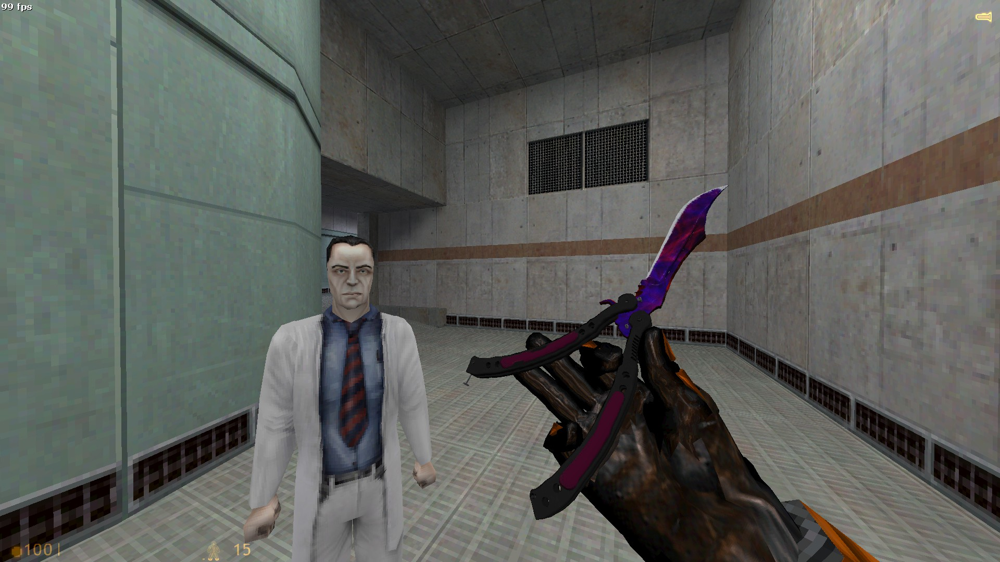

This mod is an edited version of [Zangetsu_0102's Butterfly Lore mod](https://www.moddb.com/games/half-life/addons/samurai-kittens-csgo-butterfly-knife-lore-re-rigged-for-crowbar)

I changed the model look better at 120 FOV (Speedrunner default) and edited the texture to look like a Gamma Doppler. (only the viewmodel)

If you're using a different FOV you'll have to change the $origin in `v_crowbar.qc` and recompile the model (e.g. with Crowbar)

I also made it so if you attack without hitting anything, the inspect animation will play.

## Original Mod Readme:

Original Creator's (Samurai Kitten) CS 1.6 model can be found here
https://gamebanana.com/mods/327244

Contains viewmodels (knife) and worldmodel (case) for crowbar no playermodel

### How to Install

Drag all Model files into
`steamapps/common/halflife/valve/models`

Drag sound file folder into program
`steamapps/common/halflife/valve`

## Legal

This is a fan-made, non-commercial modification for Half-Life. Some assets are derived from or based on content originally created by Valve and other credited authors. All third-party trademarks, models, textures, sounds, and related intellectual property remain the property of their respective owners.

This project is not affiliated with, endorsed by, or sponsored by Valve Corporation. Please support the original games and creators.

Credits: Valve / Counter-Strike: Global Offensive, Samurai Kitten, Zangetsu_0102.
